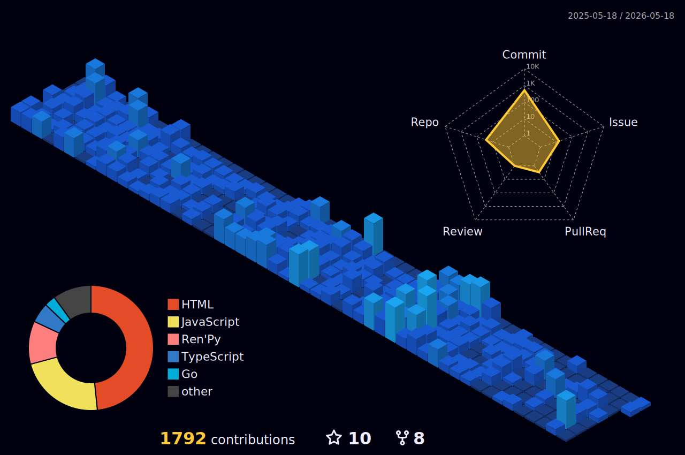

<h1 align="center">hygef-v4</h1>

  

  

  <i>Backend-focused developer with a strong interest in system design and cloud architecture.  
I enjoy building scalable systems, exploring how things work under the hood, and turning ideas into real-world products.</i>

---

## 📊 Activity

  

---

## 🐍 Contributions

  

